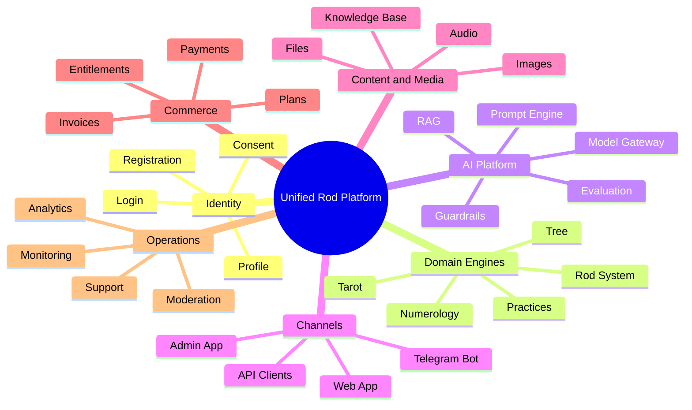
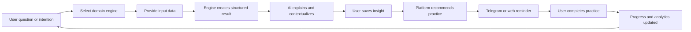
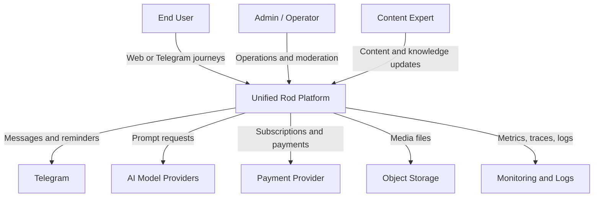

# Chapter 01 — Vision and Product Strategy

## 1. Chapter purpose

This chapter defines the product vision and strategic direction for Unified Rod Platform. It is the first architectural chapter because all future domain models, technical boundaries, API contracts, AI behavior, data models, and operational decisions must support a stable product direction.

Unified Rod Platform is not only a collection of independent features. It is a single digital ecosystem that connects personal development practices, symbolic systems, AI-assisted interpretation, Telegram interaction, structured content, and administrative operations into one coherent platform.

The purpose of this chapter is to answer five foundational questions:

1. Why should the platform exist?
2. Who is it for?
3. What user and business outcomes must it produce?
4. What capabilities must be unified?
5. Which strategic constraints must guide architecture and implementation?

## 2. Product vision

Unified Rod Platform is a modular digital platform for guided self-knowledge, symbolic interpretation, personal practices, and AI-assisted reflection. The platform combines Rod System, Tree, Tarot, Numerology, Practices, Telegram, and AI into a unified product where users can move from question to interpretation, from interpretation to practice, and from practice to long-term personal progress.

The product vision is:

> Create a trusted, extensible, AI-assisted platform that helps users explore personal meaning, lineage, symbolic systems, and practices through structured domain engines, guided journeys, and accessible digital channels.

This vision implies that the platform must be:

- unified, not a set of disconnected tools;
- modular, so each domain can evolve independently;
- explainable, so users understand why results are produced;
- safe, because symbolic and reflective experiences can influence personal decisions;
- extensible, so new practices, engines, prompts, and integrations can be added;
- API-first, so frontend, Telegram, admin, and future channels share one backend foundation.

## 3. Strategic product thesis

The core thesis is that users do not need isolated calculators, card spreads, trees, practices, or AI chats. They need a coherent experience that connects those tools into a meaningful journey.

A user may begin with a question, receive an AI-supported interpretation, save insights into a personal profile, receive a recommended practice, continue through Telegram reminders, and later return to compare progress. This requires a platform architecture where identity, content, domain engines, AI context, media, notifications, analytics, and billing are integrated through clear contracts.

The architecture must therefore optimize for product continuity rather than feature fragmentation.

## 4. Target outcomes

### 4.1 User outcomes

The platform should help users:

- receive structured interpretations from Rod, Tree, Numerology, Tarot, and Practice engines;
- understand the logic behind interpretations;
- keep personal history and saved insights;
- receive AI-assisted explanations in a tone appropriate to the product;
- follow guided practices and reminders;
- interact through web and Telegram;
- return to previous sessions and observe changes over time.

### 4.2 Business outcomes

The platform should support:

- multiple product packages and paid access levels;
- repeat engagement through practices and notifications;
- content expansion without backend rewrites;
- safe AI usage with controlled prompts and cost limits;
- analytics for product improvement;
- future marketplace or expert-service extensions.

### 4.3 Engineering outcomes

The engineering organization should gain:

- a clear modular-monolith foundation;
- stable domain boundaries;
- documented architecture decisions;
- reusable module templates;
- API-first contracts;
- a path from architecture to implementation;
- migration plans for future extraction of services if needed.

## 5. Product capability map

The initial platform capabilities are grouped into strategic capability areas.

## 6. User journey concept

The primary journey is not a single request-response action. It is a loop.

The architecture must preserve this loop across modules. A Tarot result, Numerology calculation, Rod interpretation, and Practice recommendation should not become isolated records. They should contribute to the user's long-term platform context when consent and product rules allow it.

## 7. Strategic architectural implications

### 7.1 Modular monolith first

The platform should begin as a modular monolith. This allows the team to move quickly while still preserving explicit module boundaries. The architecture must prevent uncontrolled coupling by enforcing module APIs, domain ownership, and shared-kernel rules.

Decision: start with a modular monolith and postpone microservices until there is evidence of independent scaling, team ownership, or deployment needs.

### 7.2 Plugin-ready domain engines

Rod, Tree, Tarot, Numerology, and Practices must behave like domain engines with consistent external contracts. Each engine can contain unique logic, but all engines should expose common concepts such as input schema, result schema, interpretation metadata, audit information, and explainability notes.

Decision: define engine contracts early and make each domain engine replaceable or extensible through plugin-like module boundaries.

### 7.3 AI as a platform layer, not a feature

AI should not be embedded randomly in domain modules. Prompt templates, model selection, retrieval, safety rules, evaluation, and cost control must belong to a dedicated AI platform layer.

Decision: domain modules produce structured facts and domain outputs; the AI platform transforms approved context into user-facing explanations.

### 7.4 API-first delivery

The backend must provide stable API contracts for frontend, admin, Telegram, and future clients. API governance must include versioning, error models, authentication rules, and OpenAPI documentation.

Decision: design APIs before frontend implementation and keep channel-specific behavior outside core domain logic.

### 7.5 Safety and trust by design

The platform may provide symbolic, reflective, or personal guidance. It must avoid presenting AI or symbolic outputs as deterministic truth or professional advice. User experience, prompt design, content policy, and API responses must support clear framing.

Decision: safety, disclaimers, user consent, audit logs, and AI guardrails are first-class architectural concerns.

## 8. Context diagram

## 9. Product principles

### 9.1 One platform, many engines

Users should experience a single product even when they use different symbolic systems. Backend modules may be separate, but the product language, profile, saved sessions, billing, and notifications must feel unified.

### 9.2 Structured first, generative second

Domain engines should produce structured outputs before AI generates natural-language explanations. This improves testability, repeatability, auditability, and safety.

### 9.3 Human-readable decisions

Important system decisions should be explainable. If the system recommends a practice or generates an interpretation, the platform should be able to show the source engine, input data, rule, prompt version, and generated explanation metadata.

### 9.4 Consent-aware personalization

Personalization is valuable only when it is trusted. User profile data, interpretation history, and AI memory must be governed by consent, retention rules, and privacy controls.

### 9.5 Evolution without rewrite

The first implementation must be simple enough to ship, but structured enough to grow. The architecture should allow new engines, new prompt templates, new payment rules, new content types, and new channels without rewriting the platform core.

## 10. Non-goals for the first architecture phase

The first architecture phase will not design:

- separate microservices for every module;
- a marketplace for third-party engine developers;
- mobile native applications;
- advanced multi-tenant enterprise administration;
- real-time collaborative sessions;
- fully automated expert replacement workflows.

These may become future capabilities, but they should not complicate the initial platform foundation.

## 11. Key risks

| Risk | Description | Mitigation |
| --- | --- | --- |
| Feature fragmentation | Engines evolve as disconnected tools | Shared journey model and common engine contracts |
| AI unpredictability | Generated explanations may be inconsistent | Structured engine output, prompt governance, evaluation |
| Overengineering | Architecture becomes too large before product validation | Modular monolith, staged roadmap, ADR discipline |
| Privacy concerns | Personal symbolic history may be sensitive | Consent, retention, export, deletion, audit trails |
| Content inconsistency | Different experts define conflicting interpretations | Content governance and versioning |
| Cost growth | AI calls and vector search become expensive | Model gateway, caching, budgets, usage analytics |

## 12. Acceptance criteria for this chapter

This chapter is complete when it establishes:

- a clear product vision;
- target user, business, and engineering outcomes;
- the initial capability map;
- the primary user journey loop;
- the first strategic architecture decisions;
- product principles and non-goals;
- risks that later chapters must address.

## 13. Next chapter

The next chapter is Chapter 02 — Product Principles and Success Metrics. It will convert the vision into measurable product, engineering, quality, safety, and business metrics.
