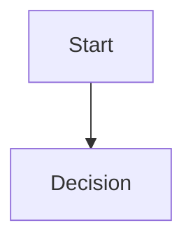

# Chapter NN — Title

## 1. Chapter purpose

## 2. Context

## 3. Detailed description

## 4. Architectural decisions

## 5. Diagrams

## 6. API examples

## 7. Development rules

## 8. Implementation recommendations

## 9. Risks and trade-offs

## 10. Acceptance criteria

## 11. Next chapter
